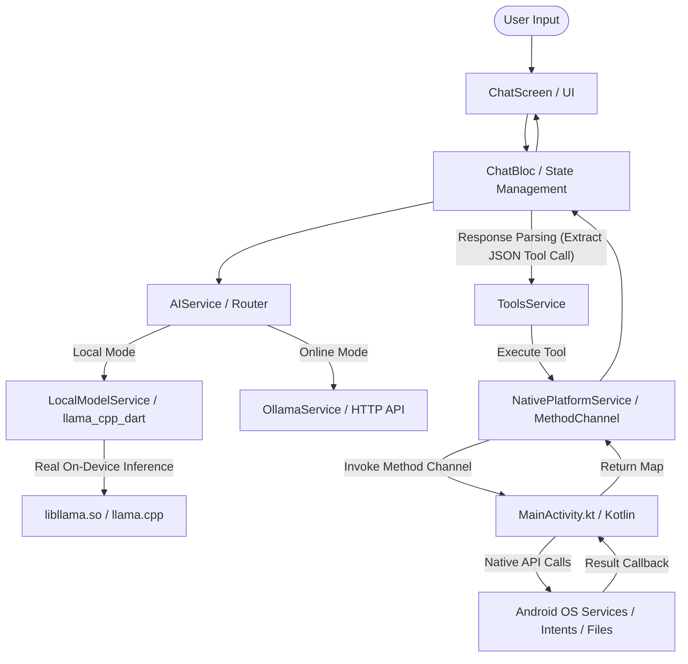

# Mobile Agent 🤖

**An on-device AI agent app that runs large language models locally — no internet, no cloud, no data leaving your device.**

Built with Flutter and powered by [llama.cpp](https://github.com/ggerganov/llama.cpp) (via `llama_cpp_dart`), Mobile Agent lets you chat with an LLM directly on your phone, desktop, or browser — fast, private, and fully offline-capable, with native tool integration (calls, SMS, emails, alarms, contacts, and file management) on Android.

---

## ✨ Features

- 🧠 **On-device inference** — runs GGUF-format LLMs locally using llama.cpp, no API keys or internet required
- 🔒 **Private by design** — your conversations never leave your device
- 📱 **Cross-platform** — Android, iOS, Windows, macOS, Linux, and Web from a single codebase
- ⚡ **BLoC state management** — predictable, testable app state
- 📦 **Local model storage** — download and manage models directly on-device
- 🛠️ **Native tool calling** — execute phone calls, SMS, alarms, contacts, and files via Kotlin MethodChannels

---

## 🏗️ Architecture Overview

The app is built using a structured architecture separating UI, Business Logic (BLoC/Cubit), AI Service routing, and Platform-Specific Native Integrations.

Below is the workflow diagram showing how user inputs trigger AI reasoning, local or network inference, tool generation, and native device action execution:



---

## 🛠️ Tech Stack & Core Technologies

| Layer / Technology | Tool / Version | Description |
|---|---|---|
| **Framework** | [Flutter](https://flutter.dev) (`>=3.9.2`) | Core cross-platform UI framework |
| **Dart SDK** | SDK `^3.9.2` | Core programming language |
| **LLM Inference** | [llama_cpp_dart](https://pub.dev/packages/llama_cpp_dart) (`^0.2.2`) | FFI bindings to load and query native `llama.cpp` shared libraries |
| **State Management** | flutter_bloc (`^8.1.3`) / bloc (`^8.1.1`) | UI state management using Cubits |
| **Networking** | http (`^1.2.0`) | Connects to local Ollama API tags/chat endpoints |
| **Storage** | path_provider (`^2.1.2`) | Documents directory for storing downloaded GGUF models |
| **Path Utilities** | path (`^1.9.0`) | Filesystem path utilities |
| **Android Native** | Kotlin / Android SDK | Native Android MethodChannels, Intents, and System Services |
| **Cross-compilation** | CMake 3.22.1 & NDK 27.0.12077973 | Builds native `libllama.so` for Android arm64-v8a |

---

## 📋 Prerequisites

- [Flutter SDK](https://docs.flutter.dev/get-started/install) (Dart SDK `^3.9.2`)
- Android Studio / Xcode (for mobile builds)
- Android NDK (`27.0.12077973` or compatible) and CMake (`3.22.1`)
- A GGUF model file (e.g. `qwen2.5-1.5b-instruct-q4_k_m.gguf` from Hugging Face or Ollama desktop)

---

## 🚀 Getting Started

1. **Clone the repository**
   ```bash
   git clone https://github.com/Akil-26/mobile_agent.git
   cd mobile_agent
   ```

2. **Install dependencies**
   ```bash
   flutter pub get
   ```

3. **Build the native llama.cpp library (Android)**
   Choose one of the helper scripts:
   - *Direct Bash (Linux / macOS):*
     ```bash
     export ANDROID_NDK_HOME=$HOME/Android/Sdk/ndk/27.0.12077973
     chmod +x build-llama-android.sh
     ./build-llama-android.sh
     ```
   - *WSL Environment (Windows Host):*
     ```bash
     chmod +x build-llama-wsl.sh
     ./build-llama-wsl.sh
     ```
   The built `libllama.so` will be placed in `android/app/src/main/jniLibs/arm64-v8a/libllama.so`.

4. **Run the app**
   ```bash
   flutter run
   ```

---

## 📂 Project Structure & Walkthrough

```
mobile_agent/
├── android/       # Android platform code & Kotlin MethodChannel implementation
├── ios/           # iOS platform code
├── linux/         # Linux desktop platform code
├── macos/         # macOS desktop platform code
├── windows/       # Windows desktop platform code
├── web/           # Web platform code
├── lib/           # Main Dart/Flutter application code
│   ├── bloc/      # BLoC / Cubit state management
│   ├── models/    # Data models (AIMode, Message, Tool definitions)
│   ├── services/  # AI routing, local llama, Ollama, native bridge, tools
│   └── ui/        # Screens and reusable UI widgets
├── test/          # Unit and widget tests
├── build-llama-android.sh  # Script to build llama.cpp native libs for Android
└── build-llama-wsl.sh      # WSL script to build llama.cpp native libs
```

### 1. Dart codebase (`lib/`)

* **`lib/main.dart`**: Entry point of the application. It initializes Flutter binding, configures MaterialApp (dark theme, Material 3), provides `ChatBloc`, `SettingsBloc`, and `ToolBloc`, and opens `ChatScreen`.
* **`lib/models/`**:
  * `ai_mode.dart`: Defines the `AIMode` enum (`local`, `ollama`, `offline`).
  * `message.dart`: Schema representing a single message in the chat conversation.
  * `tool_definitions.dart` & `tool_args.dart`: Data structures representing tools (`ToolDefinition`), invocations (`ToolCall`), and execution responses (`ToolResult`).
* **`lib/services/`**:
  * [ai_service.dart](file:///c:/projects/Mobile_apps/Mobile_agent/lib/services/ai_service.dart): Determines whether the app is offline, connected to Ollama, or using the local downloaded model. Routes user messages accordingly.
  * [local_model_service.dart](file:///c:/projects/Mobile_apps/Mobile_agent/lib/services/local_model_service.dart): Handles downloading the Qwen2.5 GGUF model file, loading it into an isolate via `llama_cpp_dart`, handling stream subscriptions, unloading, and deletion.
  * [ollama_service.dart](file:///c:/projects/Mobile_apps/Mobile_agent/lib/services/ollama_service.dart): Connects to Ollama API `http://localhost:11434` to pull available models, check availability, and query chat endpoints.
  * [native_platform_service.dart](file:///c:/projects/Mobile_apps/Mobile_agent/lib/services/native_platform_service.dart): The Dart client wrapper for the `MethodChannel` (`com.mobile_agent/native_tools`).
  * [tool_registry.dart](file:///c:/projects/Mobile_apps/Mobile_agent/lib/services/tool_registry.dart): Declares all available tools, categories, safety configuration (whether confirmation dialog is required), and formats the LLM system prompt.
  * [tools_service.dart](file:///c:/projects/Mobile_apps/Mobile_agent/lib/services/tools_service.dart): Extracts JSON-formatted tool invocations from LLM responses and routes executions.
* **`lib/bloc/`**:
  * `chat/`: Chat state management (welcome text, typing state, tool extraction, confirmation events, and app state streams).
  * `settings/`: Handles state of downloading and loading local AI model.
  * `tools/`: Manages standalone tool testing and registry details.
* **`lib/ui/`**:
  * `screens/`: Contains `chat_screen.dart`, `profile_screen.dart`, `settings_screen.dart`, `tools_management_screen.dart`, `tools_test_screen.dart`.
  * `widgets/`: Input bars, message boxes, typing animators, and tool execution dialog overlays.

### 2. Native Android Codebase (`android/`)
* **`MainActivity.kt`** (`android/app/src/main/kotlin/com/example/flutter_application_1/MainActivity.kt`): Instantiates the MethodChannel `com.mobile_agent/native_tools` and routes calls to direct Android OS APIs.

---

## 📱 Native Tool Capabilities (MethodChannel Mappings)

The assistant uses specific JSON parameters to call native APIs through the method channel handler. Tools implemented in Kotlin (`MainActivity.kt`):

### 📞 Communication
* **`make_call`**: Invokes `Intent.ACTION_CALL`. Requires `android.permission.CALL_PHONE`. Runs with safety confirmation.
* **`send_sms`**: Uses `SmsManager.getDefault().sendTextMessage`. Requires `android.permission.SEND_SMS`. Runs with safety confirmation.
* **`send_email`**: Opens mail apps using `Intent.ACTION_SENDTO` with recipient, subject, and body parameters.

### 📂 File System Operations
* **`read_file`**: Reads text files from the device path.
* **`write_file`**: Writes custom text contents to a path (creates directories automatically). Runs with safety confirmation.
* **`delete_file`**: Deletes a file. Runs with safety confirmation.
* **`list_files`**: Lists files, directory paths, size, directory flags, and modification timestamps. Defaults to the application's external files directory if no path is provided.

### ⚙️ System & Productivity
* **`get_device_info`**: Retrieves hardware parameters (manufacturer, model, OS release, SDK version, board, brand).
* **`get_battery_status`**: Queries `BatteryManager` for current capacity percentage and charging state.
* **`set_alarm`**: Invokes Android's `AlarmClock.ACTION_SET_ALARM` with specified hour, minute, and tag.
* **`open_app`**: Starts an installed application by its package name (e.g. `com.whatsapp`, `com.google.android.youtube`) using `PackageManager.getLaunchIntentForPackage`.
* **`get_contacts`**: Reads display names and telephone numbers. Requires `android.permission.READ_CONTACTS`. Runs with safety confirmation.
* **`search_contacts`**: Performs a database query using SQL `LIKE` operator matching display names against a search term.

### 🛡️ Permissions
* **`check_permission`**: Queries if a specific permission string is currently granted.
* **`request_permissions`**: Invokes standard Android runtime prompt to request permission arrays.

---

## 🤖 AI Model Configuration

The application operates in three configurations based on setup:

1. **Local Mode (Offline-First)**:
   * **Target Model**: `Qwen2.5-1.5B-Instruct-GGUF` (Quantized: `qwen2.5-1.5b-instruct-q4_k_m.gguf` - ~1.12 GB). Chosen because it fits well in mobile memory constraints (~1GB RAM overhead) while maintaining strong instruction-following skills.
   * **Host Server**: Hugging Face (downloaded inside application documents directory).
   * **Template format**: ChatML (`<|im_start|>system...`, `<|im_start|>user...`, `<|im_start|>assistant...`).
2. **Ollama Mode**:
   * **Target Model**: `gemma3:1b` (Default in configuration, editable).
   * **Network URL**: `http://localhost:11434` (Ollama desktop server).
3. **Offline Mode**:
   * Safe fallback state prompting the user to either download the local model or configure Ollama.

---

## 🔍 Troubleshooting & Key Learnings for Developers

* **Library Not Found Error**: If the application crashes on launch when loading the local model, double-check that `libllama.so` is correctly compiled and located under `android/app/src/main/jniLibs/arm64-v8a/libllama.so`.
* **Method Channel Name**: The MethodChannel name `com.mobile_agent/native_tools` must match exactly in both [native_platform_service.dart](file:///c:/projects/Mobile_apps/Mobile_agent/lib/services/native_platform_service.dart) and [MainActivity.kt](file:///c:/projects/Mobile_apps/Mobile_agent/android/app/src/main/kotlin/com/example/flutter_application_1/MainActivity.kt).
* **Package Name Mismatch**: The Android package name is configured as `com.example.flutter_application_1` in Gradle, while the workspace is named `Mobile_agent`. Be cautious when refactoring names to avoid breaking MethodChannel registrations.
* **Isolate Execution**: `llama_cpp_dart` operates local LLM inference in separate Dart Isolates (`LlamaParent`) to ensure compilation and heavy processing do not lock up or stutter the Flutter main UI Thread.

---

## 🤝 Contributing

Contributions, issues, and feature requests are welcome! Feel free to check the [issues page](https://github.com/Akil-26/mobile_agent/issues).

## 📄 License

_Add your license here (e.g. MIT, Apache 2.0)._
